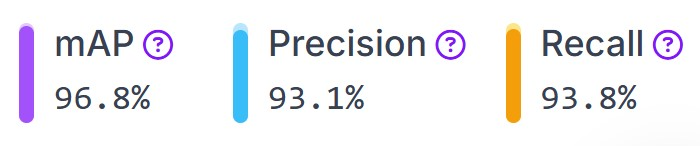
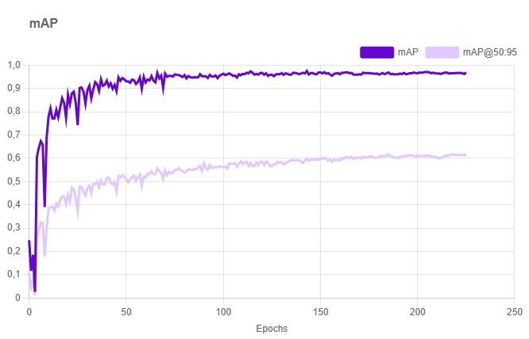
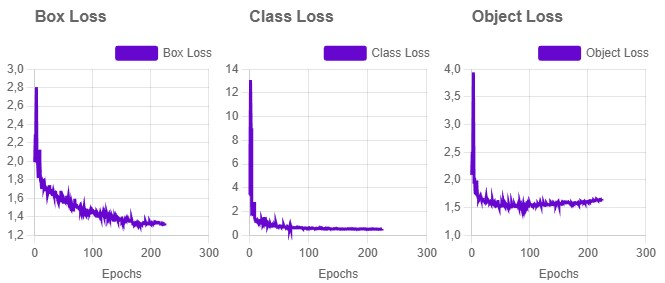
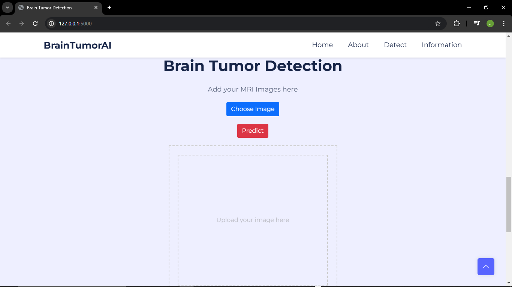
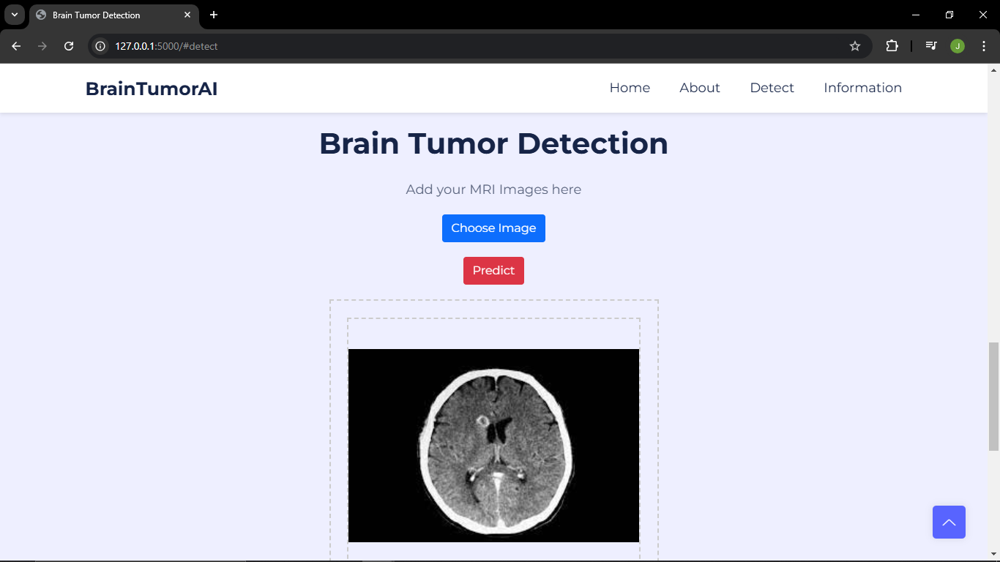
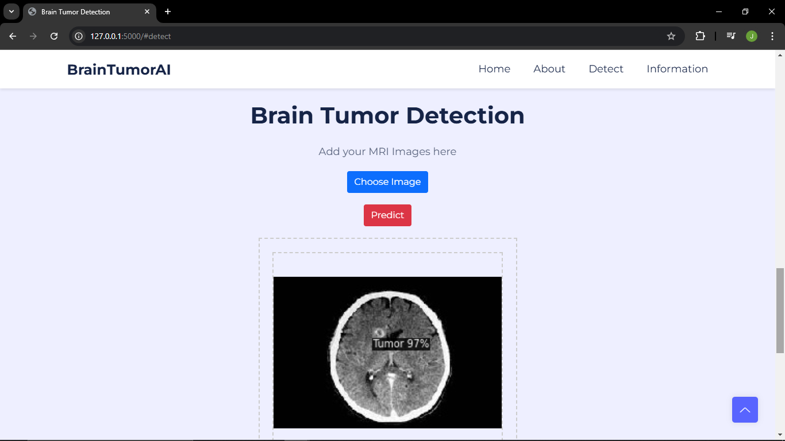
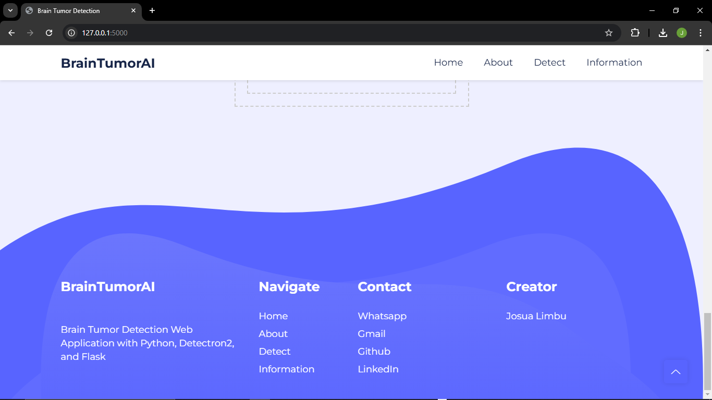

## Brain Tumor Detection Web Application

The Brain Tumor Detection Web Application is a web-based tool designed to quickly and accurately detect the presence of brain tumors through the analysis of MRI (Magnetic Resonance Imaging) images. This application is developed using Python, leveraging the Detectron2 framework for object detection and Flask for the backend. The system utilizes a custom dataset classified using the COCO (Common Objects in Context) standard on the RoboFlow platform, which facilitates dataset annotation and labeling. The dataset is trained using an object detection algorithm, enabling the application to recognize patterns or anomalies in brain images. Users simply upload an MRI image, and the system processes it to provide predictions regarding the presence of tumors, assisting doctors or radiologists in delivering faster and more accurate diagnoses. You can download the free sample dataset [here](https://bit.ly/Sampledataset_BrainTumor). Additionally, you can access the code for training the dataset using Detectron2 [here](https://colab.research.google.com/drive/10-3Uy2WMqbWTq0Z5XuDnOa3ctnNQECs7?usp=sharing).

## Performance Evaluation

<div align="center" style="display: flex; flex-direction: column; gap: 10px;">
     <br>
     <br>
    
</div>

## Install

### Install on Windows

Install [Git Bash](https://git-scm.com/downloads) and [Python](https://www.python.org/downloads/) first

After that, open git bash and follow these commands

```bash
$ https://github.com/JosuaLimbu/braintumor-detection.git
$ cd braintumor-detection
$ pip install -r requirements.txt
$ python3 app.py // flask run
```

**The end result on mobile will be like this.**


**The end result on desktop will be like this.**






